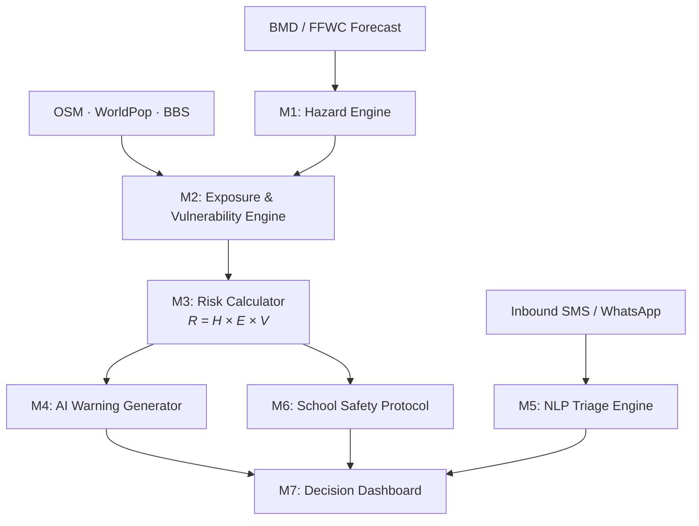
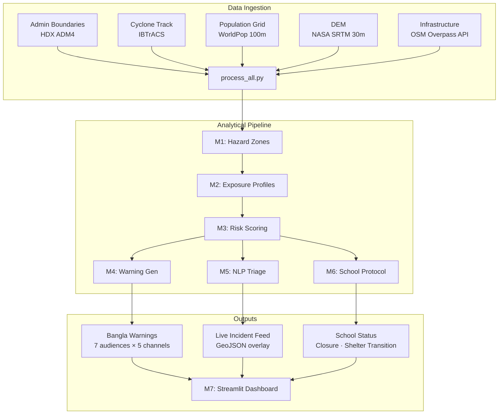
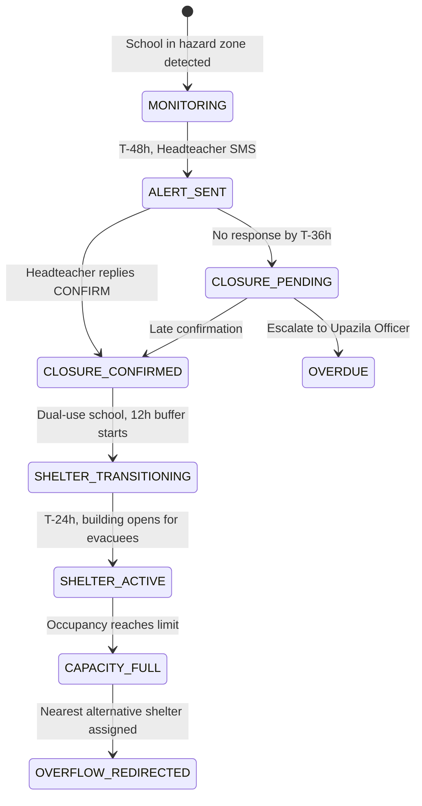

# InstaWarn

> **Automated Impact-Based Multi-Hazard Early Warning & Anticipatory Action Middleware**
>
> From forecast issuance to last-mile protective action.
🚀 **Live Demo:** [https://huggingface.co/spaces/jubayerahmad/InstaWarn](https://huggingface.co/spaces/jubayerahmad/InstaWarn)

---

## What InstaWarn Is

InstaWarn is middleware. It sits between the national meteorological forecast (BMD/FFWC) and the community-level protective action (school closure, shelter activation, evacuation). It automates the translation layer that currently depends on a slow, hierarchical bureaucratic relay chain.

It addresses **both challenge tracks** of the Mapathon 2026:

| Track | Requirement | InstaWarn Response |
| :--- | :--- | :--- |
| **Track 1**: ResilienceAI | Map critical infrastructure exposure; identify vulnerable communities; propose automated, reproducible pipelines | Modules 1-3: Spatial hazard footprints intersected with OSM infrastructure and WorldPop demographics, scored using UNDRR composite risk |
| **Track 2**: Last-Mile Warning | Overcome channel constraints, localize warnings, coordinate local authorities | Modules 4-6: Audience-specific Bangla warnings routed through connectivity-aware channels; child-centred school protocol |

Every feature traces to a specific competition requirement. Nothing is decoration.

---

## System Architecture

### High-Level Data Flow



### Module Pipeline: Sequential Dependency Chain



---

## Why Code-Based Pipelines, Not Desktop GIS

A weighted overlay in ArcGIS or QGIS produces a static risk map: one analyst, one event, one output. InstaWarn performs the **same spatial operations** (spatial joins, zonal statistics, buffer analysis, raster-vector intersection) but executes them programmatically through `GeoPandas`, `Shapely`, `rasterio`, and `rasterstats`.

The difference is operational:

| Dimension | Desktop GIS (ArcGIS / QGIS) | InstaWarn (Programmatic Pipeline) |
| :--- | :--- | :--- |
| **Reproducibility** | Analyst-dependent; click sequences not versioned | Deterministic code; identical output for identical input |
| **Speed** | Hours per event (manual layer loading, styling, export) | 76 seconds end-to-end (`run_pipeline.py`) |
| **Scalability** | One district at a time | Swap config to run any district, any hazard |
| **Action** | Produces a map | Produces maps + warnings + school protocols + triage feeds |
| **Auditability** | Project files on one machine | Open-source Git repo; any team can clone and verify |

The spatial analysis methodology is identical. What changes is **who does it**: a human analyst or an automated pipeline. For anticipatory action, where the warning window is 48-72 hours, automation is not optional.

---

## Methodologies

### M1: Hazard Footprint Generation

| Hazard | Approach | Key Parameters |
| :--- | :--- | :--- |
| **Cyclone** | Elliptical wind-radius model + distance-to-coast storm surge decay | Saffir-Simpson category → wind radii; DEM elevation < projected surge height within 15km of coast |
| **Flood** | Gauge-based thresholding against DEM | Water level above danger mark → all terrain below projected flood level adjacent to river corridor flagged |
| **Landslide** | Bivariant slope × rainfall intensity | DEM-derived slope > 25° AND cumulative rainfall > 200mm/24h → flagged |

Output: `impact_zone_{timestep}.geojson`, union polygons classified by severity (EXTREME / HIGH / MODERATE / LOW).

### M2: Exposure & Vulnerability Overlay

Automated `GeoPandas.sjoin()` intersects hazard polygons with:
- **Infrastructure**: Schools, hospitals, shelters, roads, mosques, government buildings. Extracted from OpenStreetMap via Overpass API
- **Population**: WorldPop constrained 100m grid, aggregated per union via `rasterstats.zonal_stats()`
- **Vulnerability Index**: Composite score per union:
  ```
  V = 0.3(poverty) + 0.25(shelter_gap) + 0.2(child_ratio) + 0.15(pop_density) + 0.1(1 - connectivity)
  ```

Output: `impact_profiles_{timestep}.json`, structured per-union exposure data.

### M3: Composite Risk Scoring (UNDRR Framework)

```
Risk = H(severity, time_decay) × E(infrastructure_density, shelter_gap) × V(socioeconomic_index)
```

Unions are ranked by composite score and classified into four tiers. This ranked list drives all downstream modules. Warnings are generated for the highest-priority unions first.

### M4: Impact-Based Warning Generation

Uses **Gemini 1.5-Flash** under strict system prompts. The LLM receives structured impact data (not raw meteorological data) and produces natural Bangla (বাংলা) messages tailored to:

- **7 audiences**: Fishermen, Headteachers, Parents, Union Chairmen, Upazila Officers, Shelter Committees, CPP Volunteers
- **5 channels**: SMS (160 char), IVR voice script (30s), Community radio (60s), WhatsApp (detailed), Loudspeaker (20s, shouted phrases)

Each audience receives different instructions because their protective actions differ. A fisherman secures boats; a headteacher closes a school.

### M5: NLP Triage Engine (Two-Way Crisis Loop)

Current warning systems are one-way megaphones. InstaWarn adds a return channel:

1. Chaotic inbound texts from field volunteers are parsed by a strictly constrained LLM into a Pydantic `IncidentReport` schema (incident type, urgency, headcount, resource needed)
2. Extracted locations are fuzzy-matched (Levenshtein distance via `thefuzz`) against the verified OSM infrastructure dataset
3. Matched incidents appear as live, structured pins on the Dashboard risk map

The LLM is used strictly as an ETL parser. It extracts; it does not generate facts.

### M6: School Safety Protocol (The School-Shelter Paradox)

Bangladesh has ~4,000 designated cyclone shelters. A significant portion are school buildings designed for dual use. This creates a paradox:
- The school must **close** to send children home safely (requires maximum lead time)
- The school must **open** as a shelter to receive evacuees (requires quick activation)

InstaWarn manages this transition with a phased state machine:



This is directly aligned with the competition's funding context: the GFFO Child-Centred Anticipatory Action project operated by Save the Children.

---

## Proof of Work: Cyclone Mocha Hindcast

Hindcasting (retrospective application of a system to a past event) is the standard validation method for early warning systems. InstaWarn replays the full **Cyclone Mocha, May 12-14, 2023** timeline using real data.

### Data Inputs (All Real)

| Input | Source | Citation |
| :--- | :--- | :--- |
| Cyclone track & intensity | IBTrACS / RSMC best-track archive | NCEI, NOAA |
| Administrative boundaries (Union) | geoBoundaries via HDX | ODC-ODbL |
| Infrastructure (schools, shelters, hospitals, roads) | OpenStreetMap via Overpass API | ODbL |
| Population density (100m) | WorldPop Constrained 2020 UN-adjusted | DOI: 10.5258/SOTON/WP00685 |
| Elevation (30m) | NASA SRTM V003 | DOI: 10.5067/MEASURES/SRTM/SRTMGL1.003 |

The only simulated element is the **timing of system actions**, because InstaWarn did not exist during Mocha. The pipeline proves: given this input, these outputs are produced deterministically.

### Hindcast Results (T-48h Snapshot)

| Metric | Value |
| :--- | :--- |
| Affected Unions | 32 (Coastal & Mid-Coastal Cox's Bazar) |
| Population in HIGH/EXTREME Zones | 638,692 |
| Schools Triggered for Closure Protocol | 84 |
| Shelters Activated | 38 standard + 9 dual-purpose school-shelters |
| Warning Variants Generated | 7 audiences × 5 channels = 35 unique message templates |
| Pipeline Execution Time | 76 seconds (end-to-end, single command) |

### The Warning Journey: Quantified Gap

| Milestone | Status Quo (Mocha 2023) | InstaWarn |
| :--- | :--- | :--- |
| BMD Signal 10 issued | T-48h | T-48h (same input) |
| District office notified | T-43h (~5h delay) | T-48h (instant) |
| Upazila activation begins | T-40h (~8h delay) | T-48h (instant) |
| First community loudspeaker | T-34h (~14h delay) | T-48h (instant) |
| School closure notification | Never (ad hoc) | T-48h (automated) |
| Chars & islands reached | T-6h or never | T-48h (radio + CPP routing) |

---

## Decision Dashboard (M7)

Seven interactive pages built in **Streamlit + Folium**:

| Page | Function |
| :--- | :--- |
| **Situation Map** | Live Folium map with hazard overlay, infrastructure markers, timeline scrubber |
| **Disaster Replay** | Temporal hindcast walkthrough (T-72h → T-6h) with event log |
| **Warning Journey** | Split-screen comparison: status quo delays vs. InstaWarn response |
| **Impact Intelligence** | Per-union deep dive: risk gauge, infrastructure table, shelter deficit |
| **AI Warning Generator** | Live Gemini-powered warning generation for any union × audience × channel |
| **School Monitor** | School closure status tracker with shelter transition timeline |
| **Multi-Hazard Proof** | Flood (Sylhet 2022) and Landslide (Rangamati 2017) scenarios through the same architecture |

---

## Data Sources

| Dataset | Source | Resolution / Level | License |
| :--- | :--- | :--- | :--- |
| Administrative Boundaries | [HDX geoBoundaries](https://data.humdata.org/dataset/geoboundaries-admin-boundaries-for-bangladesh) | ADM4 (Union) | ODC-ODbL |
| Infrastructure Geometry | [OpenStreetMap](https://www.openstreetmap.org/) via Overpass API | Individual features | ODbL |
| Population Density | [WorldPop](https://hub.worldpop.org/geodata/summary?id=49935) | 100m grid | CC-BY 4.0 |
| Elevation (DEM) | [NASA SRTM V003](https://doi.org/10.5067/MEASURES/SRTM/SRTMGL1.003) | 30m (1 arc-second) | Public Domain |
| Cyclone Track | [IBTrACS](https://www.ncei.noaa.gov/products/international-best-track-archive) | 6-hourly positions | Public Domain |
| Socioeconomic Indicators | BBS / World Bank | District / Upazila | Open Data |
| Shelter Capacities | DDM / HDX | Individual facilities | — |

---

## Quick Start

```bash
# 1. Setup
git clone <repo-url> && cd InstaWarn
python -m venv venv && source venv/bin/activate
pip install -r requirements.txt

# 2. Configure LLM integration
echo 'GEMINI_API_KEY = "your_key"' > .streamlit/secrets.toml

# 3. Run the full pipeline (all 7 modules)
python run_pipeline.py --event mocha_2023

# 4. Launch the dashboard
streamlit run app.py
```

**Output:** The `outputs/` directory contains:
- `maps/`: High-resolution static PNGs of impact zones per timestep
- `sample_warnings/`: Production-ready Bangla warning scripts for 7 audiences
- `risk_scores/`: Ranked union-level composite risk CSV

---

## Technical Stack

| Component | Tool | Role |
| :--- | :--- | :--- |
| Geospatial Engine | `GeoPandas`, `Shapely`, `Fiona`, `PyProj` | Spatial joins, overlay, projection. Same operations as ArcGIS/QGIS, executed programmatically |
| Raster Analysis | `rasterio`, `rasterstats` | DEM ingestion, zonal statistics for population and elevation |
| Visualization | `Folium`, `streamlit-folium`, `Matplotlib` | Interactive web maps (Leaflet.js backend) + static cartographic exports |
| Dashboard | `Streamlit` | Multipage web application framework |
| AI / NLP | `google-generativeai` (Gemini 1.5-Flash) | Warning localization + inbound triage parsing |
| Fuzzy Matching | `thefuzz` | Levenshtein distance for location name reconciliation |

---

## Project Structure

```
InstaWarn/
├── run_pipeline.py              ← One-command orchestrator (all 7 modules)
├── app.py                       ← Streamlit dashboard entry point
├── requirements.txt
├── .streamlit/
│   ├── config.toml              ← Light theme configuration
│   └── secrets.toml             ← Gemini API key (not committed)
├── src/
│   ├── config.py                ← Central path and constant registry
│   ├── data_processing/         ← Raw → processed data pipeline
│   ├── hazard_analysis/         ← Cyclone, flood, landslide zone generators
│   ├── exposure_mapping/        ← OSM overlay, vulnerability index, exposure engine
│   ├── impact_scoring/          ← Composite risk calculator
│   ├── warning_generator/       ← Gemini-powered message generation
│   ├── inbound_triage/          ← NLP parsing, fuzzy geocoding, triage processor
│   ├── school_protocol/         ← School closure / shelter transition state machine
│   └── dashboard/pages/         ← 7 Streamlit dashboard pages
├── data/
│   ├── raw/                     ← Downloaded source files (not committed)
│   ├── processed/               ← Pipeline-generated intermediaries
│   └── mocha_hindcast/          ← Scenario-specific outputs
└── outputs/
    ├── maps/                    ← Static PNGs for presentations
    ├── sample_warnings/         ← Bangla warning text files
    └── risk_scores/             ← Ranked union CSV
```

---
*Developed by:*
### Team InstaWarn

| # | Team Members | Institution |
| :---: | :--- | :--- |
| 1 | [Jubayer Ahmad](https://www.linkedin.com/in/ahmadjubayer/) | IBA, University of Rajshahi |
| 2 | [Abir Dey](https://www.linkedin.com/in/abir-dey-798073210/) | IBA, University of Rajshahi |
| 3 | [Md. Ashik Miah](https://www.linkedin.com/in/ibaiteashik/) | IBA, University of Rajshahi |

**Contact:** [jubayerahmad.c@gmail.com](mailto:jubayerahmad.c@gmail.com) | 📞 +8801797799424

---

*Developed for [Mapathon 2026](https://mapathon.rimes.int/), organized by RIMES and Save the Children under the GFFO-funded Child-Centred Anticipatory Action project.*
