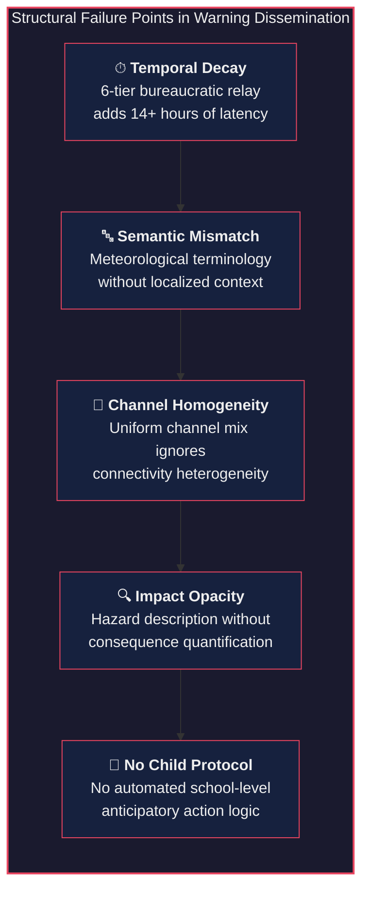
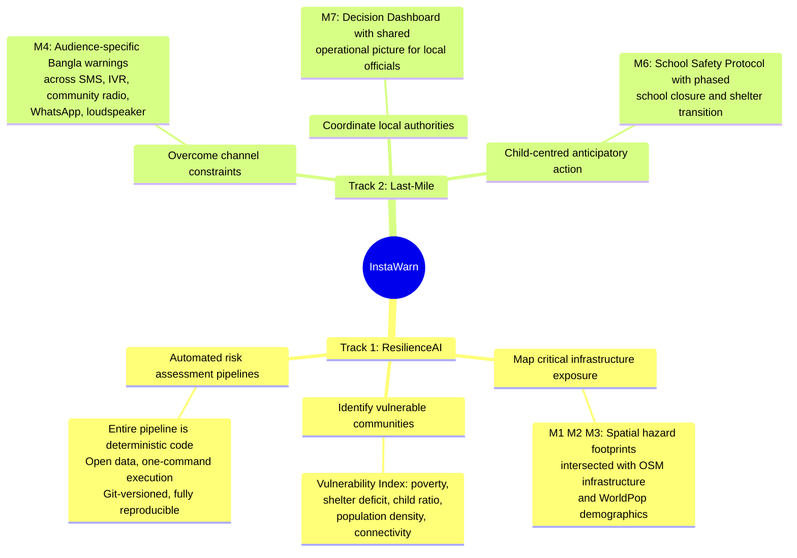
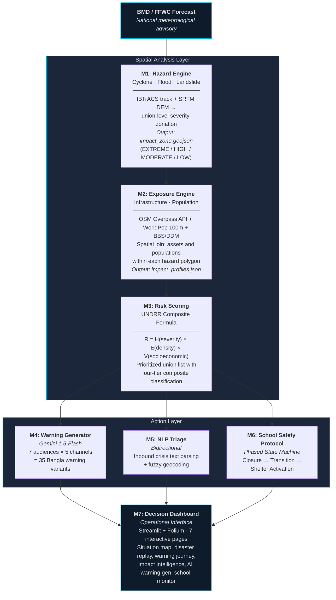
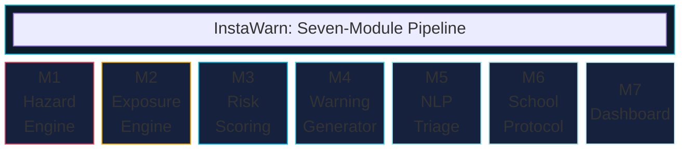
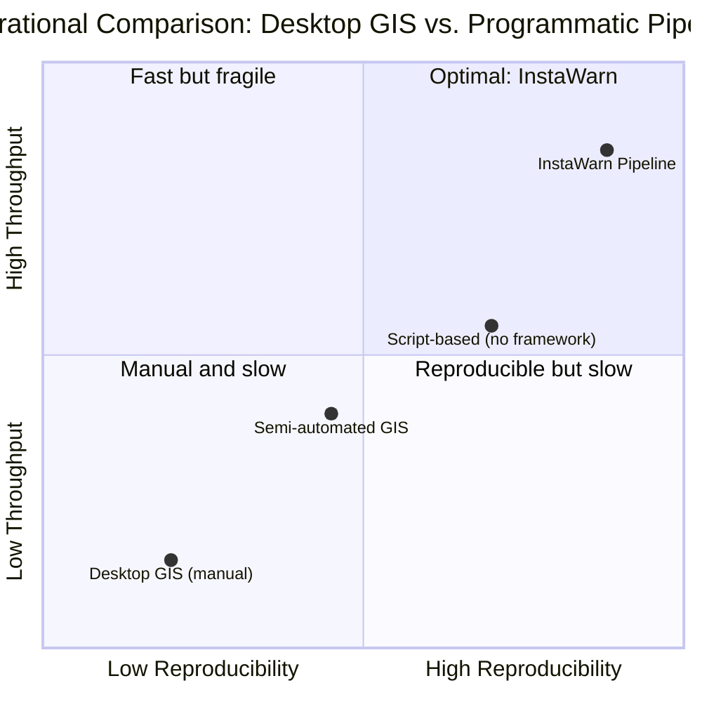
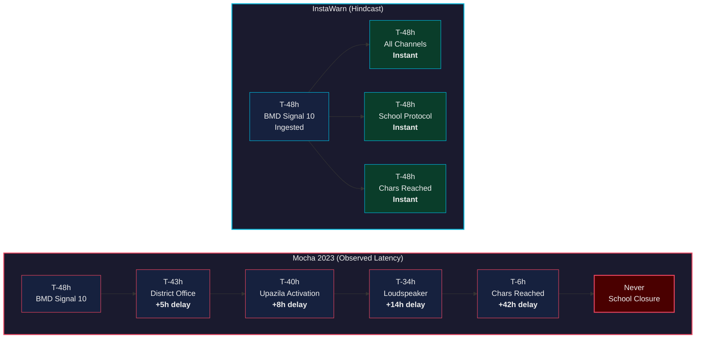
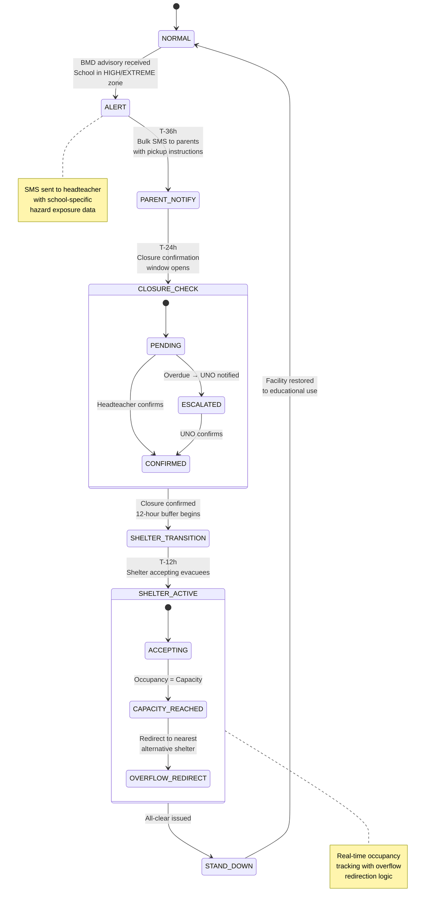
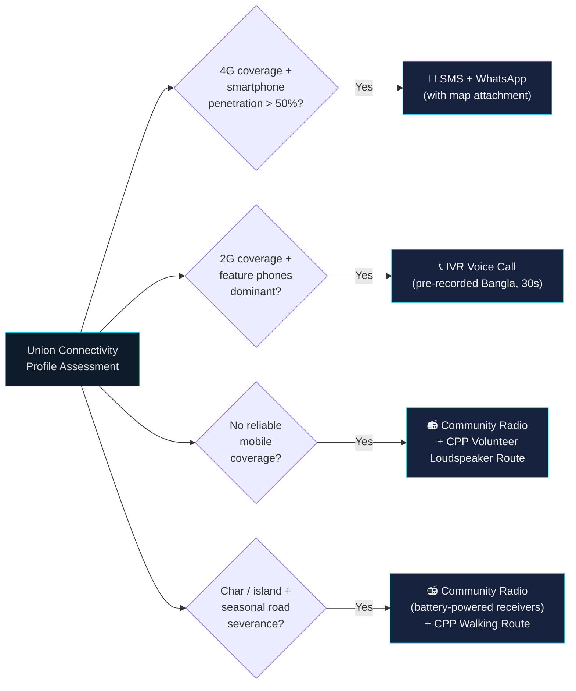
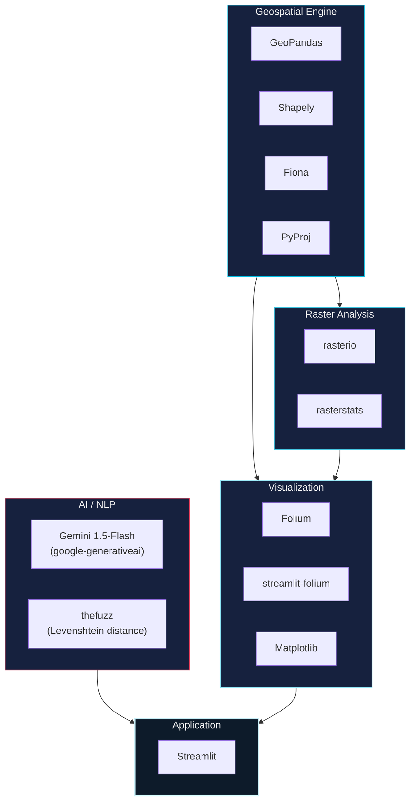

# InstaWarn

**Automated Impact-Based Multi-Hazard Early Warning Middleware for Bangladesh**

From forecast issuance to last-mile protective action: programmatic, reproducible, and built entirely on open data.

<div align="center">

[](https://huggingface.co/spaces/jubayerahmad/InstaWarn)
[](https://github.com/jubayer360/InstaWarn)
[](#data-sources)
[](#validation-cyclone-mocha-2023-hindcast)

</div>

---

<div align="center">
  <h2>🏆 Mapathon 2026 — 2nd Runner-Up</h2>
  
  <br><br>
  <b>Selected among the top 11 finalist teams from 29 competing universities. The only team from a business administration discipline among exclusively engineering and computer science finalists.</b>
</div>

---

## Table of Contents

- [Problem Statement](#problem-statement)
- [System Overview](#system-overview)
- [System Architecture](#system-architecture)
- [Module Specifications](#module-specifications)
- [Validation: Cyclone Mocha 2023 Hindcast](#validation-cyclone-mocha-2023-hindcast)
- [The School-Shelter Paradox](#the-school-shelter-paradox)
- [Channel Routing for Isolated Communities](#channel-routing-for-isolated-communities)
- [Data Limitations and Operational Honesty](#data-limitations-and-operational-honesty)
- [Technical Stack](#technical-stack)
- [Project Structure](#project-structure)
- [Quick Start](#quick-start)
- [Data Sources](#data-sources)
- [Scope and Constraints](#scope-and-constraints)
- [Team InstaWarn](#team-instawarn)

---

## Problem Statement

Bangladesh's national early warning infrastructure (BMD, FFWC, Cyclone Preparedness Programme) is among the most mature in South Asia. InstaWarn does not replace any of it.

It addresses a specific, persistent, and documented gap: **the translation layer between a national-level forecast and a community-level protective action.**

This gap manifests across five structural failure points, each documented in post-disaster evaluations and humanitarian after-action reviews:



<details>
<summary><b>Expand: Detailed Failure Point Analysis</b></summary>

| # | Failure Point | Observed Behavior | Operational Consequence |
|:-:|:---|:---|:---|
| 1 | **Temporal Decay** | BMD Signal 10 traverses a 6-tier bureaucratic relay (BMD → DDM → Division → District → Upazila → Union → Community). Each node introduces latency. | During Cyclone Mocha (May 2023), communities in southern Cox's Bazar received actionable information 14+ hours after BMD's initial Signal 10 issuance. |
| 2 | **Semantic Mismatch** | Warnings employ meteorological nomenclature (knots, hectopascals, signal numbers). Generic advisories ("stay alert") carry no location-specific intelligence. | A subsistence fisherman and a school headteacher receive identical messages, though their required protective actions differ fundamentally. |
| 3 | **Channel Homogeneity** | Warnings are disseminated through a uniform channel mix regardless of local telecommunication infrastructure. | Chars and islands with no mobile coverage, intermittent electricity, and seasonal road severance receive the same SMS-dependent approach as Dhaka. |
| 4 | **Impact Opacity** | Warnings describe the hazard ("a cyclone is approaching"), not the projected impact ("your school will flood; your nearest shelter is 24,000 persons over capacity"). | Local decision-makers lack quantified evidence to justify early, costly anticipatory actions such as school closure or shelter pre-positioning. |
| 5 | **No Child Protocol** | No standardized, automated protocol exists for school-level anticipatory action. School-as-shelter dual use creates an unresolved operational paradox. | School closure decisions are ad hoc. Children are either dismissed too late or schools close unnecessarily, eroding institutional trust. |

</details>

**Sources:** IFRC Cyclone Mocha DREF Final Report (MDRBD030), WMO Impact-Based Forecast and Warning Services framework, ReliefWeb situation updates, BTRC/ITU connectivity data.

---

## System Overview

InstaWarn is **middleware**: a seven-module automated pipeline that sits between the national meteorological forecast and the community-level protective action. It ingests a BMD/FFWC advisory and produces hyperlocal, audience-specific, channel-routed warning messages in Bangla, with a dedicated child-safety protocol.

### Alignment with Mapathon 2026 Challenge Tracks



---

## System Architecture

### End-to-End Data Flow: Forecast to Protective Action



### Logical Decomposition



---

## Module Specifications

### M1: Hazard Engine

| Attribute | Detail |
|:---|:---|
| **Purpose** | Generate union-level hazard severity polygons from meteorological forecast data |
| **Cyclone Model** | Elliptical wind-radius decay model applied against coastal DEM; storm surge inundation depth estimated via SRTM 30m elevation thresholds |
| **Flood Model** | Gauge-based river stage exceedance mapped against DEM-derived floodplain delineation |
| **Landslide Model** | Slope gradient (derived from SRTM) weighted by antecedent rainfall intensity |
| **Toolchain** | GeoPandas, rasterio, Shapely |
| **Output** | `impact_zone_{timestep}.geojson` with union polygons classified into four severity tiers |

### M2: Exposure Engine

| Attribute | Detail |
|:---|:---|
| **Purpose** | Quantify infrastructure assets and population within each hazard polygon |
| **Method** | Automated `sjoin()` of hazard polygons with OSM infrastructure layers (schools, hospitals, shelters, roads) and WorldPop 100m population raster via `zonal_stats()` |
| **Toolchain** | GeoPandas, rasterstats, Overpass API |
| **Output** | `impact_profiles.json` with per-union infrastructure counts, population totals, and shelter capacity figures |

### M3: Risk Scoring

| Attribute | Detail |
|:---|:---|
| **Purpose** | Compute composite risk scores per union using the UNDRR framework |
| **Formula** | `R = H(severity, temporal_decay) × E(infrastructure_density, shelter_gap) × V(poverty_index, child_ratio, connectivity_score)` |
| **Toolchain** | NumPy, Pandas |
| **Output** | Ranked union list with four-tier classification (EXTREME, HIGH, MODERATE, LOW) |

### M4: Warning Generator

| Attribute | Detail |
|:---|:---|
| **Purpose** | Produce localized, audience-specific warning messages in Bangla |
| **Method** | Gemini 1.5-Flash under constrained system prompts; receives structured impact data, returns natural-language Bangla messages |
| **Audience Matrix** | 7 audiences (fishermen, farmers, headteachers, parents, CPP volunteers, local officials, general public) × 5 channels (SMS, IVR, community radio, WhatsApp, loudspeaker) = **35 warning variants per union** |
| **Toolchain** | google-generativeai |

### M5: NLP Triage

| Attribute | Detail |
|:---|:---|
| **Purpose** | Parse inbound crisis reports into structured incident records with geolocation |
| **Method** | Inbound text parsed into Pydantic schema (incident type, urgency level, headcount, resource requirement); location resolved via Levenshtein distance fuzzy matching against the OSM gazetteer |
| **Toolchain** | thefuzz, Gemini (ETL parser only) |
| **Output** | Live structured incident GeoJSON overlay on the decision dashboard |

### M6: School Safety Protocol

| Attribute | Detail |
|:---|:---|
| **Purpose** | Manage the phased transition of school buildings from educational use to emergency shelter function |
| **Method** | Deterministic finite state machine with time-gated transitions (see [State Machine Diagram](#the-school-shelter-paradox)) |
| **Output** | Real-time school status feed + shelter availability tracker with overflow redirection |

### M7: Decision Dashboard

| Attribute | Detail |
|:---|:---|
| **Purpose** | Provide a shared operational picture for local decision-makers |
| **Pages** | Situation Map · Disaster Replay · Warning Journey · Impact Intelligence · AI Warning Generator · School Monitor · Multi-Hazard Proof |
| **Toolchain** | Streamlit, Folium, streamlit-folium |

---

## Why Programmatic Pipelines, Not Desktop GIS

InstaWarn performs the same spatial operations as ArcGIS or QGIS (spatial joins, zonal statistics, buffer analysis, raster-vector intersection) but executes them through `GeoPandas`, `Shapely`, `rasterio`, and `rasterstats` in code.



| Dimension | Desktop GIS Workflow | InstaWarn Pipeline |
|:---|:---|:---|
| **Reproducibility** | Analyst-dependent click sequences; not version-controlled | Deterministic code; identical input produces identical output |
| **Throughput** | Hours per event (manual layer loading, styling, export) | 76 seconds end-to-end |
| **Scalability** | One district at a time | Configuration-driven; substitute district or hazard type via parameter |
| **Output Scope** | Static maps | Maps + localized warnings + school protocols + triage feeds |
| **Auditability** | Project file on one workstation | Open-source Git repository; any party can clone, inspect, and verify |

For anticipatory action within a 48 to 72 hour warning window, automated processing is not optional: it is a prerequisite.

---

## Validation: Cyclone Mocha 2023 Hindcast

Hindcasting (retrospective application of a system to a historical event using empirical data) is the standard validation methodology for early warning systems, endorsed by both WMO and ECMWF. InstaWarn replays Cyclone Mocha (May 12-14, 2023) using real datasets to demonstrate that, given this input, these outputs are produced deterministically.

### Data Inputs

| Input | Source | Spatiotemporal Resolution | License |
|:---|:---|:---|:---|
| Cyclone track and intensity | IBTrACS (NCEI, NOAA) | 6-hourly positions | Public Domain |
| Administrative boundaries | geoBoundaries via HDX | ADM4 (Union) | ODC-ODbL |
| Infrastructure | OpenStreetMap via Overpass API | Individual features | ODbL |
| Population density | WorldPop Constrained 2020 | 100m grid | CC-BY 4.0 |
| Elevation | NASA SRTM V003 | 30m (1 arc-second) | Public Domain |

> **Note:** The temporal sequencing of system actions is simulated (InstaWarn did not exist during Mocha). The spatial analysis operates on real geospatial data; the pipeline demonstrates what outputs it would have generated given the same meteorological inputs.

### Hindcast Results at T-48h

| Metric | Value |
|:---|:---|
| Unions classified HIGH/EXTREME | 32 (Coastal Cox's Bazar) |
| Population within impact zone | 638,692 |
| Schools triggered for closure protocol | 84 |
| Shelters activated | 38 standard + 9 dual-purpose school-shelters |
| Warning variants generated | 35 (7 audiences × 5 channels) |
| Pipeline execution time | 76 seconds |

### Warning Dissemination Timeline: Observed vs. InstaWarn



| Milestone | Mocha 2023 (Observed) | InstaWarn (Hindcast) | Latency Reduction |
|:---|:---|:---|:---|
| BMD Signal 10 issued | T-48h | T-48h (same input) | Baseline |
| District office notified | T-43h (~5h delay) | T-48h (instantaneous) | 5 hours |
| Upazila activation begins | T-40h (~8h delay) | T-48h (instantaneous) | 8 hours |
| First community loudspeaker | T-34h (~14h delay) | T-48h (instantaneous) | 14 hours |
| School closure notification | Never (ad hoc) | T-48h (automated) | ∞ → 0 |
| Chars and islands reached | T-6h or never | T-48h (radio + CPP routing) | 42+ hours |

---

## The School-Shelter Paradox

Bangladesh has approximately 4,000 designated cyclone shelters. A significant proportion are school buildings designed for dual use. This creates a direct operational conflict:

- The school must **close** to dismiss children safely (requires maximum lead time)
- The school must **open** as a shelter to receive evacuees (requires rapid activation)

No existing system manages this transition programmatically. Module 6 implements a **deterministic finite state machine** with time-gated phase transitions:



This protocol directly serves the competition's funding context: the GFFO Child-Centred Anticipatory Action project, implemented by Save the Children.

---

## Channel Routing for Isolated Communities

Expert practitioners rightly ask: how does InstaWarn reach communities that are truly isolated, not merely underserved, but physically separated, with structural telecommunication deficits?

InstaWarn's answer is the **Channel Routing Engine** (embedded in M4), which assigns the optimal dissemination channel per union based on that union's connectivity profile:



The routing logic is fully functional in the prototype. The precision of the connectivity input data remains the constraint, and that limitation is documented transparently in the section below.

For truly isolated communities, the critical infrastructure is not the mobile handset. It is the **CPP volunteer network** (60,000+ volunteers operating across coastal Bangladesh) and **community radio stations**. InstaWarn generates content formatted for these channels: 20-second loudspeaker scripts and 60-second radio announcements, in natural Bangla, with location-specific shelter directions.

---

## Data Limitations and Operational Honesty

InstaWarn's prototype uses the best available open data. It does not claim this data is complete. This section documents known gaps, because exposing where data quality degrades is itself operationally valuable for any system intended for field deployment.

<details>
<summary><b>Expand: Known Data Gaps and Mitigation Strategies</b></summary>

| Data Layer | Known Gap | Current Mitigation | Requirement for Full Deployment |
|:---|:---|:---|:---|
| **OSM Infrastructure** | Incomplete at union level. Road segments may be absent or geometrically misaligned. Shelter records are sparse in rural unions. | Pipeline consumes available OSM data and flags unions with anomalously low infrastructure counts as "data-deficient." | Ground-truthed infrastructure registry maintained through existing disaster management committee structures. Accuracy validation against satellite imagery (Google Earth Engine). |
| **Shelter Capacity** | DDM shelter inventory is neither fully digitized nor publicly accessible. Many shelters lack recorded capacity figures. | Where capacity is unknown, the system applies a conservative default estimate (800 persons per shelter) and flags the assumption. Demand-supply analysis operates on available data with explicit uncertainty markers. | Digitized, web-accessible DDM shelter database with field-verified capacities. Community-level data enrichment in high-risk zones. |
| **Connectivity Profiles** | Union-level mobile coverage, smartphone penetration, and community radio presence are approximated from BTRC aggregate statistics and OpenCelliD tower geolocation, not measured per union. | Channel routing uses best available proxy indicators. The routing logic is architecturally sound; the input precision is limited. | BTRC/operator-level union coverage maps. Field survey of communication channel availability per union. |
| **Population Dynamics** | WorldPop provides static residential population estimates. It does not account for seasonal labor migration (e.g., fishermen relocating to the coast), displaced populations, or institutional populations. | Static population count used. No temporal adjustment. | Integration with UNHCR/IOM displacement datasets for areas with refugee populations. Seasonal migration models for coastal livelihoods. |

</details>

> **This is not a weakness to conceal. Any system that claims to operate at union-level granularity must confront these data quality gaps.** InstaWarn's architecture is designed so that when higher-fidelity data becomes available (from LGED, DDM, field surveys, or community mapping initiatives) it integrates directly into the existing pipeline without architectural modification. The modules consume structured inputs; improve the input fidelity, and the output quality improves proportionally.

---

## Technical Stack



Built entirely on free, open-source tooling. Deployable at a total cost under $200/year (Gemini API costs for warning generation). No proprietary GIS licenses required.

---

## Project Structure

```
InstaWarn/
├── run_pipeline.py              ← One-command orchestrator (all 7 modules)
├── app.py                       ← Streamlit dashboard entry point
├── requirements.txt
├── .streamlit/
│   ├── config.toml
│   └── secrets.toml             ← Gemini API key (not committed)
├── src/
│   ├── config.py                ← Central path and constant registry
│   ├── data_processing/         ← Raw → processed data pipeline
│   ├── hazard_analysis/         ← Cyclone, flood, landslide zone generators
│   ├── exposure_mapping/        ← OSM overlay, vulnerability index
│   ├── impact_scoring/          ← Composite risk calculator (H × E × V)
│   ├── warning_generator/       ← Gemini-powered Bangla message generation
│   ├── inbound_triage/          ← NLP parsing, fuzzy geocoding
│   ├── school_protocol/         ← School closure / shelter transition FSM
│   └── dashboard/pages/         ← 7 Streamlit dashboard pages
├── data/
│   ├── raw/                     ← Source files (not committed; see Data Sources)
│   ├── processed/               ← Pipeline-generated intermediaries
│   └── mocha_hindcast/          ← Cyclone Mocha scenario outputs
└── outputs/
    ├── maps/                    ← Static PNGs of impact zones per timestep
    ├── sample_warnings/         ← Bangla warning text files (7 audiences)
    └── risk_scores/             ← Ranked union-level composite risk CSV
```

---

## Quick Start

```bash
# Clone and set up environment
git clone https://github.com/jubayer-ahmad/InstaWarn.git && cd InstaWarn
python -m venv venv && source venv/bin/activate
pip install -r requirements.txt

# Configure API access
echo 'GEMINI_API_KEY = "your_key"' > .streamlit/secrets.toml

# Execute full pipeline (76 seconds)
python run_pipeline.py --event mocha_2023

# Launch decision dashboard
streamlit run app.py
```

---

## Data Sources

| Dataset | Source | Spatiotemporal Resolution | License |
|:---|:---|:---|:---|
| Administrative Boundaries | HDX geoBoundaries | ADM4 (Union) | ODC-ODbL |
| Infrastructure | OpenStreetMap via Overpass API | Individual features | ODbL |
| Population Density | WorldPop Constrained 2020 | 100m grid | CC-BY 4.0 |
| Elevation (DEM) | NASA SRTM V003 | 30m (1 arc-second) | Public Domain |
| Cyclone Track | IBTrACS (NCEI, NOAA) | 6-hourly positions | Public Domain |
| Socioeconomic Indicators | BBS / World Bank | District / Upazila | Open Data |
| Shelter Capacities | DDM / HDX | Individual facilities | Government |

---

## Scope and Constraints

InstaWarn is explicitly bounded in scope:

- It **does not replace** BMD, FFWC, DDM, or the Cyclone Preparedness Programme.
- It **is not a finished product**. It is a functional prototype validated on one historical event (Cyclone Mocha 2023).
- It **does not claim data completeness**. It documents where data is absent and specifies what higher-fidelity data would enable.
- It **does not generate forecasts**. It consumes forecasts and translates them into actionable, localized protective intelligence.

What it demonstrates: that the translation layer, from national forecast to community protective action, can be automated, reproduced, and operated on open data at a cost any district office can sustain.

---

## Team InstaWarn

<div align="center">

| Member | Institution |
|:---|:---|
| [**Jubayer Ahmad**](https://www.linkedin.com/in/ahmadjubayer/) | IBA, University of Rajshahi |
| [**Abir Dey**](https://www.linkedin.com/in/abir-dey-798073210/) | IBA, University of Rajshahi |
| [**Md. Ashik Miah**](https://www.linkedin.com/in/ibaiteashik/) | IBA, University of Rajshahi |

📧 **Contact:** jubayerahmad.c@gmail.com · +8801797799424

</div>

---

<div align="center">
  <i>Developed for Mapathon 2026, organized by RIMES and Save the Children under the GFFO-funded Child-Centred Anticipatory Action project.</i>
  <br><br>
  
  
  
</div>
